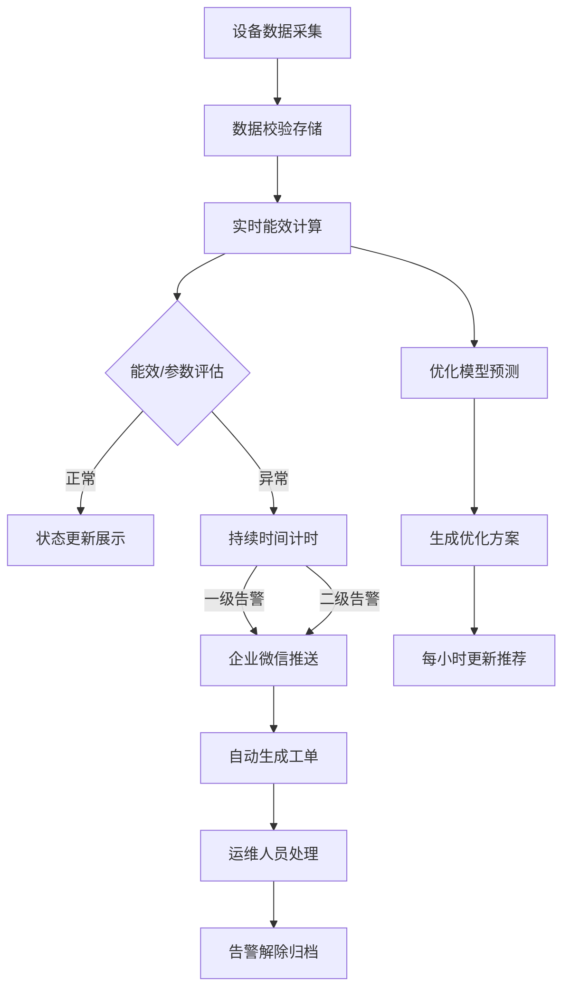

## 1. 产品概述

智能建筑中央空调冷站群控与能效优化系统是一套面向大型商业综合体的全栈应用，通过实时采集冷站设备运行数据，运用人工智能模型进行能效优化，实现设备智能群控、能耗精细化管理和节能诊断。系统针对3台离心式冷水机组、2台螺杆式冷水机组、8台冷却塔、12台冷冻水泵、12台冷却水泵进行统一监控与优化调度。

- **主要用途**：实现冷站设备集中监控、能效优化、故障预警与节能管理
- **解决问题**：传统人工控制能效低、设备故障发现滞后、能耗数据不透明等问题
- **目标用户**：商业综合体物业管理人员、暖通工程师、节能运维人员
- **产品目标**：实现冷站系统COP提升15%以上，综合节能10%-20%

## 2. 核心功能

### 2.1 用户角色

| 角色 | 注册方式 | 核心权限 |
|------|---------|---------|
| 系统管理员 | 账号密码登录 | 设备配置、用户管理、系统参数设置、告警规则配置 |
| 运维工程师 | 账号密码登录 | 设备监控、告警处理、工单管理、查看诊断报告 |
| 管理者 | 账号密码登录 | 查看能耗统计、能效分析、节能报告、系统概览 |

### 2.2 功能模块

1. **系统概览页**：冷站流程图、关键指标卡片、实时告警列表、能效优化推荐
2. **设备监控页**：设备列表、运行状态监控、参数详情、历史趋势
3. **能效分析页**：COP趋势分析、能耗统计、节能诊断报告、设备能效排名
4. **优化策略页**：设备组合推荐、温度设定值优化、优化效果对比
5. **告警管理页**：告警列表、告警详情、工单管理、告警统计
6. **系统设置页**：设备配置、阈值设置、用户管理、企业微信配置

### 2.3 页面详情

| 页面名称 | 模块名称 | 功能描述 |
|---------|---------|----------|
| 系统概览页 | 冷站系统流程图 | Canvas绘制设备与管道，水流方向箭头动画，设备颜色随能效状态变化（绿/黄/红） |
| 系统概览页 | 关键指标卡片 | 当日累计能耗、实时COP、节能量三大核心指标实时展示 |
| 系统概览页 | 设备详情面板 | 点击设备弹出面板，展示近24小时运行参数趋势和能效曲线 |
| 系统概览页 | 实时告警列表 | 展示最新告警信息，支持快速处理 |
| 系统概览页 | 优化推荐卡片 | 展示每小时更新的最优设备启停组合和冷冻水温度设定值 |
| 能效分析页 | 能效评估 | 实时COP与设计COP比值计算，低于70%生成节能诊断报告 |
| 告警管理页 | 两级告警 | 一级告警（参数超限10分钟）、二级告警（COP低于60%持续30分钟） |
| 告警管理页 | 告警推送 | 企业微信推送告警信息并自动生成工单 |

## 3. 核心流程

### 3.1 数据采集与处理流程

设备每30秒通过BACnet/IP上报运行数据 → 后端数据采集服务接收并解析 → 数据校验与清洗 → 实时数据库存储 → 能效计算与状态评估 → 触发告警规则 → 前端WebSocket实时推送

### 3.2 能效优化流程

收集历史运行数据 → 提取特征（冷冻水出水温度、冷却水进水温度、负荷率、设备组合）→ 神经网络模型训练 → 预测不同设备组合下的系统COP → 生成最优启停组合和温度设定值 → 每小时更新推荐方案 → 运维人员确认执行

### 3.3 告警处理流程

设备参数超限检测 → 持续时间计时（10分钟/30分钟）→ 触发对应级别告警 → 企业微信推送通知 → 自动生成运维工单 → 工单分配与处理 → 告警解除归档

## 4. 用户界面设计

### 4.1 设计风格

- **主色调**：工业蓝（#165DFF）- 代表专业、科技感
- **辅助色**：能效绿（#00B42A）、警告黄（#FF7D00）、故障红（#F53F3F）
- **中性色**：深灰（#1D2129）、中灰（#4E5969）、浅灰（#C9CDD4）、背景（#F2F3F5）
- **按钮风格**：圆角8px，微投影，hover状态提升
- **字体**：数字使用 JetBrains Mono，正文使用 PingFang SC，标题使用思源黑体
- **布局风格**：卡片式布局，顶部导航+左侧菜单+主内容区三栏结构
- **图标风格**：线性简洁图标，使用lucide-react图标库

### 4.2 页面设计概述

| 页面名称 | 模块名称 | UI元素 |
|---------|---------|--------|
| 系统概览页 | 冷站系统流程图 | 深色背景Canvas，设备图标+标签，动态箭头，悬停高亮，点击交互 |
| 系统概览页 | 关键指标卡片 | 玻璃拟态风格，大号数字展示，趋势小图表，渐变边框 |
| 系统概览页 | 设备详情面板 | 右侧滑出面板，ECharts趋势图，参数表格，状态标签 |
| 系统概览页 | 优化推荐卡片 | 推荐优先级标识，节能预估，一键应用按钮 |
| 能效分析页 | 诊断报告 | 分章节报告格式，问题点高亮，改进建议列表 |
| 告警管理页 | 告警列表 | 按级别颜色区分，时间线样式，处理状态标签 |

### 4.3 响应式设计

- **桌面端优先**：适配1920×1080及以上分辨率，支持2K/4K显示
- **平板适配**：1024px-1440px，菜单可折叠，图表自适应
- **移动适配**：768px-1024px，简化布局，关键指标优先展示
- **触摸优化**：按钮最小44×44px，支持滑动操作，关键操作二次确认

### 4.4 Canvas流程图设计

- **画布背景**：深色渐变背景（#0F172A至#1E293B），网格线辅助
- **设备图标**：
  - 冷水机组：长方形+压缩机图形，标注"离心"或"螺杆"
  - 冷却塔：圆形+散热波纹图形
  - 水泵：圆形+叶轮图形，标注"冷冻"或"冷却"
- **管道线条**：
  - 冷冻水供水管：蓝色实线（#3B82F6）
  - 冷冻水回水管：蓝色虚线
  - 冷却供水管：青色实线（#06B6D4）
  - 冷却回水管：青色虚线
- **水流动画**：三角形箭头沿管道移动，速度模拟水流大小
- **状态颜色**：
  - 绿色（#00B42A）：高效运行，COP ≥ 设计值90%
  - 黄色（#FF7D00）：效率偏低，COP在70%-90%之间
  - 红色（#F53F3F）：故障或低效，COP < 70%或设备故障
