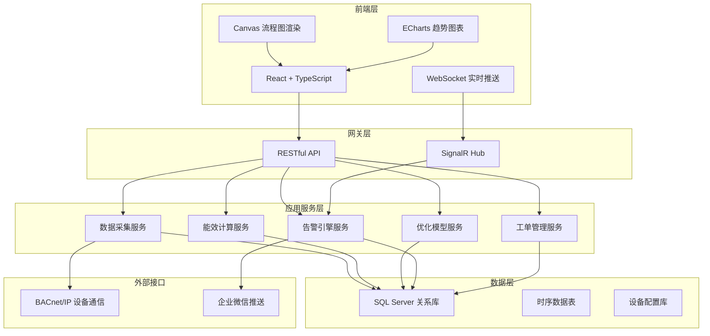
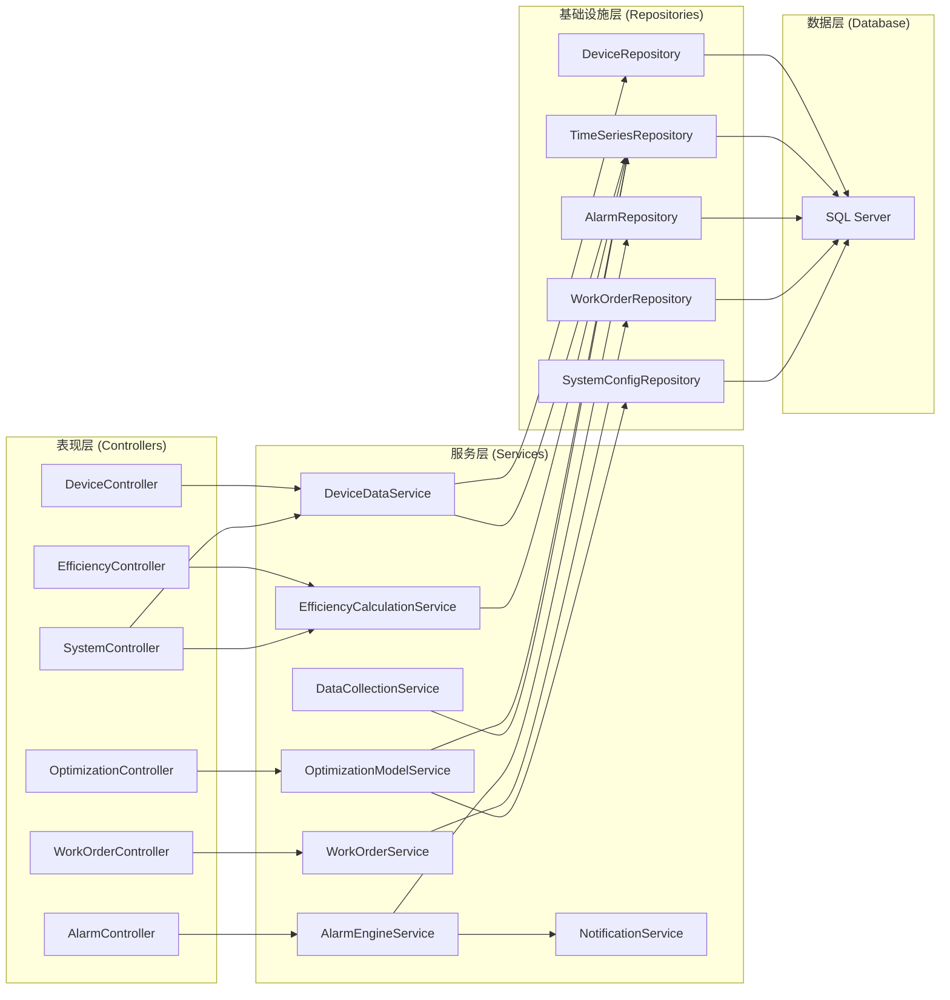
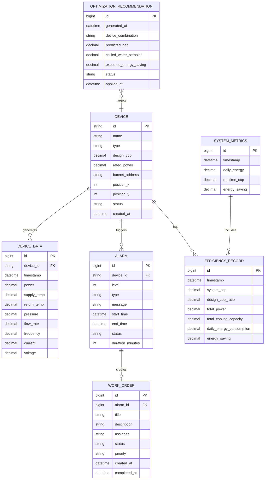

## 1. 架构设计

本系统采用分层架构设计，前端通过Canvas实现可视化展示，后端采用C# .NET 8构建高性能服务，数据库使用SQL Server存储海量时序数据。



## 2. 技术描述

### 2.1 前端技术栈
- **框架**：React@18 + TypeScript@5
- **构建工具**：Vite@5
- **样式方案**：TailwindCSS@3
- **状态管理**：Zustand@4
- **路由管理**：React Router@6
- **图表组件**：ECharts@5
- **图标库**：lucide-react@0.294
- **实时通信**：@microsoft/signalr@7

### 2.2 后端技术栈
- **框架**：.NET 8 + ASP.NET Core Web API
- **ORM**：Entity Framework Core 8
- **数据库**：SQL Server 2022
- **实时通信**：SignalR
- **机器学习**：Microsoft.ML 3.0（决策树回归 + 神经网络）
- **BACnet协议**：BACnet Library（自定义实现）
- **依赖注入**：原生DI容器
- **日志**：Serilog + Seq

### 2.3 数据库设计
- **时序数据分区**：按日期分区存储设备运行数据
- **索引优化**：针对时间范围查询建立聚集索引
- **缓存策略**：Redis缓存实时数据和热点配置

## 3. 前端路由定义

| 路由路径 | 页面名称 | 核心功能 |
|---------|---------|---------|
| / | 系统概览页 | 冷站流程图、关键指标、实时告警、优化推荐 |
| /devices | 设备监控页 | 设备列表、运行状态、参数详情 |
| /efficiency | 能效分析页 | COP趋势、能耗统计、诊断报告 |
| /optimization | 优化策略页 | 设备组合推荐、温度优化 |
| /alarms | 告警管理页 | 告警列表、工单管理 |
| /settings | 系统设置页 | 设备配置、阈值设置、用户管理 |

## 4. API 定义

### 4.1 设备数据接口

```typescript
// 设备基础信息
interface Device {
  id: string;
  name: string;
  type: 'centrifugal_chiller' | 'screw_chiller' | 'cooling_tower' | 'chilled_water_pump' | 'cooling_water_pump';
  status: 'running' | 'stopped' | 'fault' | 'standby';
  efficiencyStatus: 'high' | 'normal' | 'low' | 'fault';
  designCop: number;
  currentCop: number;
  position: { x: number; y: number };
}

// 设备实时数据
interface DeviceRealtimeData {
  deviceId: string;
  timestamp: Date;
  power: number;
  supplyTemperature: number;
  returnTemperature: number;
  pressure: number;
  flowRate: number;
  frequency: number;
  current: number;
  voltage: number;
  operatingHours: number;
}

// 趋势数据
interface TrendDataPoint {
  timestamp: Date;
  value: number;
}
```

### 4.2 接口列表

| 接口路径 | 方法 | 功能描述 |
|---------|------|---------|
| /api/devices | GET | 获取所有设备列表 |
| /api/devices/{id} | GET | 获取设备详情 |
| /api/devices/{id}/realtime | GET | 获取设备实时数据 |
| /api/devices/{id}/trend | GET | 获取设备24小时趋势数据 |
| /api/efficiency/cop/realtime | GET | 获取系统实时COP |
| /api/efficiency/cop/trend | GET | 获取COP历史趋势 |
| /api/efficiency/energy/daily | GET | 获取当日累计能耗 |
| /api/efficiency/energy/saving | GET | 获取节能量统计 |
| /api/efficiency/diagnosis | GET | 获取节能诊断报告 |
| /api/optimization/recommendation | GET | 获取最优设备组合推荐 |
| /api/optimization/optimize | POST | 应用优化方案 |
| /api/alarms | GET | 获取告警列表 |
| /api/alarms/{id}/acknowledge | POST | 确认告警 |
| /api/workorders | GET | 获取工单列表 |
| /api/workorders/{id}/process | POST | 处理工单 |
| /api/system/metrics | GET | 获取系统关键指标 |

## 5. 服务器架构图



## 6. 数据模型

### 6.1 实体关系图



### 6.2 数据定义语言（DDL）

```sql
-- 设备表
CREATE TABLE Devices (
    Id NVARCHAR(50) PRIMARY KEY,
    Name NVARCHAR(100) NOT NULL,
    DeviceType INT NOT NULL,
    DesignCOP DECIMAL(18,4) NOT NULL,
    RatedPower DECIMAL(18,4) NOT NULL,
    BACnetAddress NVARCHAR(100) NOT NULL,
    PositionX INT NOT NULL,
    PositionY INT NOT NULL,
    Status INT NOT NULL DEFAULT 0,
    CreatedAt DATETIME2 NOT NULL DEFAULT GETUTCDATE()
);

-- 设备时序数据表（按日期分区）
CREATE TABLE DeviceData (
    Id BIGINT IDENTITY(1,1) PRIMARY KEY,
    DeviceId NVARCHAR(50) NOT NULL,
    Timestamp DATETIME2 NOT NULL,
    Power DECIMAL(18,4) NOT NULL,
    SupplyTemperature DECIMAL(18,4) NOT NULL,
    ReturnTemperature DECIMAL(18,4) NOT NULL,
    Pressure DECIMAL(18,4) NOT NULL,
    FlowRate DECIMAL(18,4) NOT NULL,
    Frequency DECIMAL(18,4) NULL,
    Current DECIMAL(18,4) NULL,
    Voltage DECIMAL(18,4) NULL
);

CREATE INDEX IX_DeviceData_DeviceId_Timestamp ON DeviceData (DeviceId, Timestamp DESC);

-- 告警表
CREATE TABLE Alarms (
    Id BIGINT IDENTITY(1,1) PRIMARY KEY,
    DeviceId NVARCHAR(50) NULL,
    AlarmLevel INT NOT NULL,
    AlarmType INT NOT NULL,
    Message NVARCHAR(500) NOT NULL,
    StartTime DATETIME2 NOT NULL,
    EndTime DATETIME2 NULL,
    Status INT NOT NULL DEFAULT 0,
    DurationMinutes INT NOT NULL DEFAULT 0,
    Acknowledged BIT NOT NULL DEFAULT 0,
    AcknowledgedBy NVARCHAR(50) NULL,
    AcknowledgedAt DATETIME2 NULL
);

-- 工单表
CREATE TABLE WorkOrders (
    Id BIGINT IDENTITY(1,1) PRIMARY KEY,
    AlarmId BIGINT NULL,
    Title NVARCHAR(200) NOT NULL,
    Description NVARCHAR(1000) NOT NULL,
    Assignee NVARCHAR(50) NULL,
    Status INT NOT NULL DEFAULT 0,
    Priority INT NOT NULL DEFAULT 1,
    CreatedAt DATETIME2 NOT NULL DEFAULT GETUTCDATE(),
    CompletedAt DATETIME2 NULL,
    CompletedBy NVARCHAR(50) NULL,
    Resolution NVARCHAR(1000) NULL
);

-- 能效记录表
CREATE TABLE EfficiencyRecords (
    Id BIGINT IDENTITY(1,1) PRIMARY KEY,
    Timestamp DATETIME2 NOT NULL,
    SystemCOP DECIMAL(18,4) NOT NULL,
    DesignCOPRatio DECIMAL(18,4) NOT NULL,
    TotalPower DECIMAL(18,4) NOT NULL,
    TotalCoolingCapacity DECIMAL(18,4) NOT NULL,
    DailyEnergyConsumption DECIMAL(18,4) NOT NULL,
    EnergySaving DECIMAL(18,4) NOT NULL
);

-- 优化推荐表
CREATE TABLE OptimizationRecommendations (
    Id BIGINT IDENTITY(1,1) PRIMARY KEY,
    GeneratedAt DATETIME2 NOT NULL DEFAULT GETUTCDATE(),
    DeviceCombination NVARCHAR(500) NOT NULL,
    PredictedCOP DECIMAL(18,4) NOT NULL,
    ChilledWaterSetpoint DECIMAL(18,4) NOT NULL,
    ExpectedEnergySaving DECIMAL(18,4) NOT NULL,
    Status INT NOT NULL DEFAULT 0,
    AppliedAt DATETIME2 NULL,
    AppliedBy NVARCHAR(50) NULL
);

-- 系统指标表
CREATE TABLE SystemMetrics (
    Id BIGINT IDENTITY(1,1) PRIMARY KEY,
    Timestamp DATETIME2 NOT NULL DEFAULT GETUTCDATE(),
    DailyEnergy DECIMAL(18,4) NOT NULL,
    RealtimeCOP DECIMAL(18,4) NOT NULL,
    EnergySaving DECIMAL(18,4) NOT NULL
);

-- 告警阈值配置表
CREATE TABLE AlarmThresholds (
    Id INT IDENTITY(1,1) PRIMARY KEY,
    ParameterName NVARCHAR(100) NOT NULL,
    DeviceType INT NULL,
    UpperLimit DECIMAL(18,4) NULL,
    LowerLimit DECIMAL(18,4) NULL,
    DurationMinutes INT NOT NULL DEFAULT 10,
    AlarmLevel INT NOT NULL DEFAULT 1,
    Enabled BIT NOT NULL DEFAULT 1
);
```
