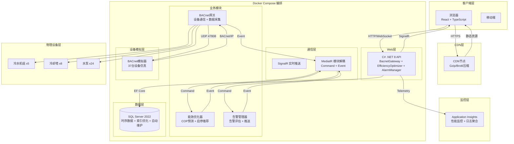
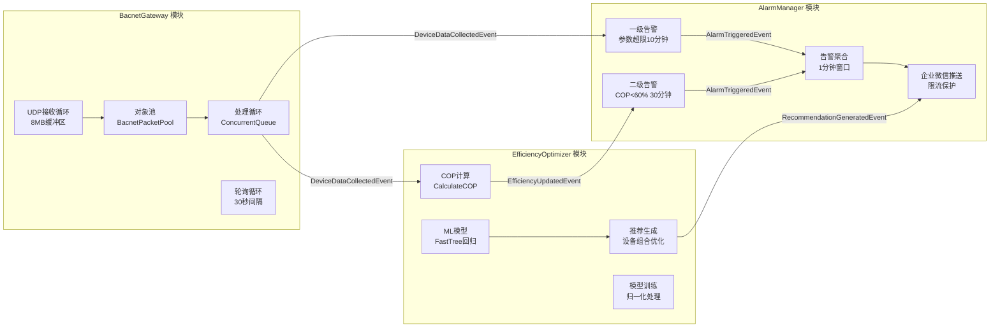

# 智能建筑中央空调冷站群控与能效优化系统

## 项目概述

本系统是一套完整的中央空调冷站智能监控与能效优化全栈应用，适用于大型商业综合体的冷站设备群控管理。系统通过BACnet/IP协议实时采集37台设备的运行数据，使用机器学习模型进行能效优化，实现设备最优启停组合推荐和节能诊断。

---

## 系统架构

### 整体架构图



### 模块架构图



---

## 部署架构

### Docker Compose 服务编排

```
┌─────────────────────────────────────────────────────────────────┐
│                     Docker Network: chiller-net                 │
│                     Subnet: 172.28.0.0/16                       │
│                                                                 │
│  ┌─────────────────┐  ┌─────────────────┐  ┌─────────────────┐  │
│  │   sqlserver     │  │      api        │  │    simulator    │  │
│  │  (172.28.0.10)  │  │  (172.28.0.20)  │  │  (172.28.0.30)  │  │
│  ├─────────────────┤  ├─────────────────┤  ├─────────────────┤  │
│  │ Image:          │  │ Build:          │  │ Build:          │  │
│  │ mssql:2022      │  │ ./backend       │  │ ./simulator     │  │
│  │ Ports: 1433     │  │ Ports: 5000     │  │ Ports: -        │  │
│  │ Mem: 4GB        │  │ Mem: 2GB        │  │ Mem: 512MB      │  │
│  │ CPU: 2.0        │  │ CPU: 2.0        │  │ CPU: 1.0        │  │
│  └────────┬────────┘  └────────┬────────┘  └────────┬────────┘  │
│           │                    │                    │           │
│  healthcheck │  healthcheck │  healthcheck │
│  (tcp:1433)  │  (http:/health) │  (custom)     │
│           │                    │                    │           │
│  depends_on:sqlserver  depends_on:api                 │           │
│           │                    │                    │           │
└───────────┴────────────────────┴────────────────────┴───────────┘
            │                    │                    │
      ┌─────┴─────┐        ┌─────┴─────┐        ┌─────┴─────┐
      │ sqlserver │        │  api-logs │        │ simulator │
      │   data    │        │ api-models│        │   logs    │
      └───────────┘        └───────────┘        └───────────┘
      (Docker Volume)      (Docker Volume)      (Docker Volume)
```

---

## 设备配置

| 设备类型 | 数量 | 设备编号 | 额定功率 | 设计COP |
|---------|------|---------|---------|---------|
| 离心式冷水机组 | 3台 | CEN-CH-001 ~ 003 | 800kW | 5.8 |
| 螺杆式冷水机组 | 2台 | SCR-CH-001 ~ 002 | 500kW | 5.2 |
| 冷却塔 | 8台 | CT-001 ~ 008 | 75kW | 35.0 |
| 冷冻水泵 | 12台 | CHP-001 ~ 012 | 90kW | 20.0 |
| 冷却水泵 | 12台 | CWP-001 ~ 012 | 75kW | 25.0 |

**总计: 37台设备，每30秒上报一次数据**

---

## 部署步骤

### 一、环境要求

- Docker Engine 24.0+
- Docker Compose v2.20+
- 至少 8GB 可用内存
- 至少 20GB 可用磁盘空间

### 二、Docker Compose 一键部署

#### 1. 配置环境变量

编辑 `.env` 文件：

```bash
# 数据库配置
SA_PASSWORD=YourStrongPassword123!
SQL_SERVER_HOST=sqlserver
SQL_SERVER_PORT=1433

# API配置
API_PORT=5000
ASPNETCORE_ENVIRONMENT=Production

# 时区配置
TZ=Asia/Shanghai

# Application Insights 连接字符串（可选）
APPLICATIONINSIGHTS_CONNECTION_STRING=InstrumentationKey=xxx;IngestionEndpoint=xxx;LiveEndpoint=xxx

# CDN配置（可选）
VITE_ENABLE_CDN=false
VITE_CDN_BASE=https://cdn.example.com/chiller-plant/
```

#### 2. 启动服务

```bash
# 构建并启动所有服务
docker-compose up -d --build

# 查看服务状态
docker-compose ps

# 查看日志
docker-compose logs -f api
docker-compose logs -f simulator
docker-compose logs -f sqlserver
```

#### 3. 初始化数据库

```bash
# 等待SQL Server启动（约30秒），然后执行初始化脚本
docker exec -i chiller-sqlserver /opt/mssql-tools/bin/sqlcmd \
  -S localhost -U sa -P YourStrongPassword123! \
  -i /var/opt/mssql/backup/InitializeDatabase.sql

# 执行索引优化脚本
docker exec -i chiller-sqlserver /opt/mssql-tools/bin/sqlcmd \
  -S localhost -U sa -P YourStrongPassword123! \
  -i /var/opt/mssql/backup/maintenance/01_Index_Optimization.sql

# 执行SQL Agent作业配置
docker exec -i chiller-sqlserver /opt/mssql-tools/bin/sqlcmd \
  -S localhost -U sa -P YourStrongPassword123! \
  -i /var/opt/mssql/backup/maintenance/04_Agent_Jobs.sql
```

#### 4. 验证部署

```bash
# 健康检查
curl http://localhost:5000/health

# 预期输出: {"status":"Healthy","totalDuration":"00:00:00.0000000"}

# 访问前端
# 浏览器打开: http://localhost:5000
```

#### 5. 常用运维命令

```bash
# 停止服务
docker-compose down

# 重启服务
docker-compose restart

# 查看资源使用
docker-compose stats

# 清理旧镜像
docker image prune -f

# 查看模拟器运行状态
docker exec chiller-simulator python -c "import json; print(json.load(open('config.json'))['devices'][:3])"
```

### 三、前端CDN部署

#### 1. 构建前端

```bash
cd frontend

# 安装依赖
npm install

# 配置CDN（修改.env.production）
echo "VITE_ENABLE_CDN=true" > .env.production
echo "VITE_CDN_BASE=https://cdn.example.com/chiller-plant/" >> .env.production

# 构建生产版本
npm run build
```

#### 2. 上传到CDN

```bash
# dist目录结构
dist/
├── index.html
├── assets/
│   ├── js/
│   │   ├── vendor-[hash].js
│   │   ├── vendor-[hash].js.gz
│   │   ├── vendor-[hash].js.br
│   │   ├── echarts-[hash].js
│   │   ├── echarts-[hash].js.gz
│   │   └── ...
│   ├── css/
│   │   ├── [name]-[hash].css
│   │   ├── [name]-[hash].css.gz
│   │   └── ...
│   └── img/
│       └── [name]-[hash].png
```

上传 `dist/assets` 目录到CDN，保留目录结构。`index.html` 由API服务提供。

---

## BACnet模拟器配置说明

### 配置文件路径

`simulator/config.json`

### 核心配置项

#### 1. 设备配置

```json
{
  "devices": [
    {
      "device_id": 1,
      "name": "CEN-CH-001",
      "type": "centrifugal_chiller",
      "instance_number": 1001,
      "ip_address": "0.0.0.0",
      "port": 47808,
      "rated_power": 800,
      "design_cop": 5.8
    }
  ]
}
```

#### 2. 采集间隔

```json
{
  "collection_interval_seconds": 30
}
```

#### 3. 设备性能曲线

```json
{
  "device_performance_curves": {
    "centrifugal_chiller": {
      "coefficients": {
        "a": -2.5,
        "b": 8.5,
        "c": -1.2
      },
      "optimal_load_range": [0.4, 0.85],
      "part_load_efficiency": {
        "1.0": 1.0,
        "0.9": 1.03,
        "0.8": 1.08,
        "0.7": 1.12,
        "0.6": 1.15,
        "0.5": 1.10,
        "0.4": 1.05,
        "0.3": 0.95,
        "0.2": 0.85
      }
    },
    "screw_chiller": {
      "coefficients": {
        "a": -1.8,
        "b": 6.8,
        "c": -0.8
      },
      "optimal_load_range": [0.3, 0.9],
      "part_load_efficiency": {
        "1.0": 1.0,
        "0.8": 1.05,
        "0.6": 1.08,
        "0.4": 1.02,
        "0.2": 0.90
      }
    },
    "cooling_tower": {
      "coefficients": {
        "a": -0.5,
        "b": 2.5,
        "c": 33.0
      },
      "optimal_load_range": [0.5, 0.95],
      "part_load_efficiency": {
        "1.0": 1.0,
        "0.75": 1.08,
        "0.5": 1.02,
        "0.25": 0.85
      }
    },
    "chilled_water_pump": {
      "coefficients": {
        "a": -0.3,
        "b": 1.5,
        "c": 18.8
      },
      "optimal_load_range": [0.6, 0.9],
      "part_load_efficiency": {
        "1.0": 1.0,
        "0.8": 1.06,
        "0.6": 1.08,
        "0.4": 0.95
      }
    },
    "cooling_water_pump": {
      "coefficients": {
        "a": -0.4,
        "b": 1.8,
        "c": 23.6
      },
      "optimal_load_range": [0.6, 0.9],
      "part_load_efficiency": {
        "1.0": 1.0,
        "0.8": 1.05,
        "0.6": 1.07,
        "0.4": 0.94
      }
    }
  }
}
```

**性能曲线公式**:
```
COP = a × load_rate² + b × load_rate + c
其中 load_rate ∈ [0, 1]
```

**部分负荷效率**:
```
实际COP = 计算COP × 部分负荷效率系数
```

#### 4. 场景配置（24小时负荷曲线）

```json
{
  "scenarios": {
    "normal": {
      "load_profile": [
        {"hour": 0, "load": 0.3},
        {"hour": 6, "load": 0.4},
        {"hour": 8, "load": 0.7},
        {"hour": 10, "load": 0.85},
        {"hour": 12, "load": 0.9},
        {"hour": 14, "load": 0.95},
        {"hour": 16, "load": 0.9},
        {"hour": 18, "load": 0.8},
        {"hour": 20, "load": 0.7},
        {"hour": 22, "load": 0.5}
      ]
    }
  }
}
```

#### 5. 故障模拟配置

```json
{
  "fault_simulation": {
    "enabled": true,
    "fault_probability": 0.02,
    "fault_duration_minutes": 30,
    "fault_types": [
      {"type": "high_discharge_pressure", "parameter": "discharge_pressure", "multiplier": 1.3},
      {"type": "low_suction_temperature", "parameter": "suction_temperature", "offset": -5},
      {"type": "reduced_heat_exchange", "parameter": "cop", "multiplier": 0.7}
    ]
  }
}
```

### 环境变量覆盖

模拟器支持通过环境变量覆盖配置：

```bash
# Docker Compose 中配置
simulator:
  build: ./simulator
  environment:
    - SIM_COLLECTION_INTERVAL=30
    - SIM_TARGET_API_URL=http://api:5000
    - SIM_DEVICE_COUNT=37
    - SIM_ENABLE_FAULTS=true
    - SIM_FAULT_PROBABILITY=0.02
    - TZ=Asia/Shanghai
```

### 手动测试模拟器

```bash
# 进入模拟器容器
docker exec -it chiller-simulator bash

# 查看当前设备状态
python bacnet_simulator.py --status

# 模拟故障
python bacnet_simulator.py --inject-fault CEN-CH-001 high_discharge_pressure

# 清除故障
python bacnet_simulator.py --clear-fault CEN-CH-001

# 查看性能曲线
python bacnet_simulator.py --show-curve centrifugal_chiller
```

---

## Application Insights 监控配置

### 启用监控

在 `.env` 中配置连接字符串：

```bash
APPLICATIONINSIGHTS_CONNECTION_STRING=InstrumentationKey=xxx;IngestionEndpoint=xxx;LiveEndpoint=xxx
```

### 监控内容

| 监控项 | 说明 |
|-------|------|
| **请求追踪** | 所有API请求的响应时间、状态码、依赖调用 |
| **性能计数器** | CPU、内存、线程池、GC统计 |
| **依赖追踪** | SQL查询、HTTP调用的耗时和成功率 |
| **日志聚合** | Serilog日志自动发送到Application Insights |
| **自定义指标** | COP值、设备在线率、告警数量 |
| **异常检测** | 自动检测性能异常和失败率突增 |

### 查看监控

1. 登录 Azure Portal
2. 找到 Application Insights 资源
3. 查看：
   - **Application Map**: 服务依赖拓扑
   - **Performance**: API性能和依赖耗时
   - **Failures**: 失败请求和异常
   - **Metrics**: 自定义指标图表
   - **Logs**: Kusto查询日志

### 自定义遥测

```csharp
// 在代码中埋点
var telemetry = new TelemetryClient();
telemetry.TrackMetric("SystemCOP", copValue);
telemetry.TrackEvent("OptimizationGenerated",
    new Dictionary<string, string> { {"RecommendationId", id} });
```

---

## SQL Server 自动维护计划

### 索引优化策略

#### 1. 覆盖索引配置（已在01_Index_Optimization.sql中定义）

| 表名 | 索引字段 | INCLUDE列 | 填充因子 |
|-----|---------|----------|---------|
| DeviceData | Timestamp DESC, DeviceId | Power, SupplyTemp, ReturnTemp, FlowRate, COP | 90 |
| DeviceData | DeviceId, Timestamp DESC | Power, SupplyTemp, ReturnTemp | 90 |
| DeviceData | Timestamp DESC, DeviceId, IsFault | Power | 90 |
| EfficiencyRecords | Timestamp DESC | TotalPower, TotalCooling, SystemCOP | 90 |
| Alarms | Timestamp DESC, IsActive | Level, DeviceId, Type | 90 |

#### 2. 智能索引维护（02_Index_Maintenance.sql）

```sql
-- 自动判断索引维护方式
-- 碎片率 > 30%: REBUILD (重建)
-- 碎片率 5% ~ 30%: REORGANIZE (重组)
-- 碎片率 < 5%: 跳过

EXEC dbo.IndexMaintenance;
```

#### 3. 统计信息自动更新（03_Statistics_Update.sql）

```sql
-- 大表（>100万行）: 10% 采样
-- 小表: FULLSCAN 全量扫描

EXEC dbo.UpdateStatistics;
```

### SQL Agent 作业（04_Agent_Jobs.sql）

| 作业名称 | 调度时间 | 执行内容 |
|---------|---------|---------|
| **每日统计信息更新** | 每天 01:00 | 执行 UpdateStatistics 存储过程 |
| **每周索引维护** | 每周日 02:00 | 执行 IndexMaintenance 存储过程 |
| **每日数据清理** | 每天 03:00 | 清理一年前的 DeviceData，半年前的告警 |

### 验证维护计划

```sql
-- 查看索引碎片
SELECT
    OBJECT_NAME(ips.object_id) AS TableName,
    i.name AS IndexName,
    ips.avg_fragmentation_in_percent,
    ips.page_count
FROM sys.dm_db_index_physical_stats(DB_ID(), NULL, NULL, NULL, 'DETAILED') ips
JOIN sys.indexes i ON ips.object_id = i.object_id AND ips.index_id = i.index_id
WHERE ips.avg_fragmentation_in_percent > 5
ORDER BY ips.avg_fragmentation_in_percent DESC;

-- 查看作业执行历史
SELECT
    j.name AS JobName,
    h.run_date,
    h.run_time,
    h.run_duration,
    CASE h.run_status
        WHEN 0 THEN '失败'
        WHEN 1 THEN '成功'
        WHEN 2 THEN '重试'
        WHEN 3 THEN '取消'
    END AS Status
FROM msdb.dbo.sysjobs j
JOIN msdb.dbo.sysjobhistory h ON j.job_id = h.job_id
ORDER BY h.run_date DESC, h.run_time DESC;
```

---

## 前端性能优化

### Gzip/Brotli 双压缩

`vite.config.ts` 已配置双压缩：

```typescript
viteCompression({
  algorithm: 'gzip',    // Gzip 压缩
  threshold: 10240,     // 大于10KB的文件压缩
  ext: '.gz',
}),
viteCompression({
  algorithm: 'brotliCompress',  // Brotli 压缩（更高压缩率）
  threshold: 10240,
  ext: '.br',
})
```

### 代码分割策略

```typescript
manualChunks: {
  vendor: ['react', 'react-dom', 'react-router-dom'],   // 基础框架
  echarts: ['echarts', 'echarts-for-react'],            // 图表库
  signalr: ['@microsoft/signalr'],                      // 实时通信
  axios: ['axios'],                                     // HTTP客户端
}
```

### CDN 部署流程

```
构建阶段:
  1. npm run build
  2. 生成 dist/assets 目录（含 .gz 和 .br 文件）
  3. 上传 dist/assets 到 CDN
  4. index.html 由 API 服务器提供

部署阶段:
  Nginx 配置（API服务器）:
    - 检测 Accept-Encoding 头
    - 优先返回 .br 文件（如果支持）
    - 其次返回 .gz 文件
    - 静态资源设置强缓存 Cache-Control: public, max-age=31536000
    - index.html 设置协商缓存 Cache-Control: no-cache
```

---

## 核心功能

### 1. 数据采集与存储
- BACnet/IP协议通信，每30秒采集所有设备数据
- 8MB UDP接收缓冲区 + 对象池 + 队列池化，无丢包
- 时序数据存储，支持高性能查询

### 2. 可视化监控 (Canvas + Vue)
- 冷站系统流程图动态展示（ChillerFlow.vue）
- 设备图标根据能效状态变色（绿/黄/红）
- 管道水流方向箭头动画（60fps）
- 点击设备查看详情和24小时趋势曲线（DeviceDetail.vue）
- 实时指标展示：当日能耗、实时COP、节能量

### 3. 能效优化模型
- 基于Microsoft.ML的FastTree回归算法
- 输入特征归一化处理（MinMax）
- 预测不同设备组合下的系统COP
- 每小时生成最优设备启停方案和冷冻水温度设定值
- 节能潜力分析和预期节电效果

### 4. 能效评估与诊断
- 实时COP计算：制冷量/总功率
- 能效比 = 实时COP / 设计COP
- 低于70%自动生成节能诊断报告
- 包含问题分析和改进建议

### 5. 两级告警系统

| 告警级别 | 触发条件 | 持续时间 | 处理方式 |
|---------|---------|---------|---------|
| 一级告警 | 设备参数超限 | 10分钟 | 企业微信推送 + 工单 |
| 二级告警 | 系统COP < 设计值×60% | 30分钟 | 企业微信推送 + 工单 |

- 1分钟内同类型告警自动聚合，避免限流
- 最大推送延迟2分钟

### 6. 工单管理
- 告警自动生成工单
- 工单流转：创建→指派→处理→完成→关闭
- 处理记录和解决方案追踪

---

## 技术栈

### 后端
- **框架**: .NET 8 + ASP.NET Core Web API
- **模块化**: BacnetGateway + EfficiencyOptimizer + AlarmManager
- **解耦**: MediatR (CQRS模式)
- **ORM**: Entity Framework Core 8.0
- **机器学习**: Microsoft.ML 3.0.1 (FastTree回归)
- **实时通信**: SignalR
- **日志**: Serilog + Application Insights
- **监控**: Application Insights
- **数据库**: SQL Server 2022
- **容器化**: Docker 多阶段构建 + Alpine 精简镜像

### 前端
- **框架**: React 18 + TypeScript + Vue 3
- **构建工具**: Vite 5.0
- **图表**: ECharts 5.5
- **实时通信**: @microsoft/signalr
- **HTTP客户端**: Axios
- **压缩**: Gzip + Brotli
- **部署**: CDN 加速

### 数据库
- SQL Server 2022
- 智能索引维护
- 自动统计信息更新
- SQL Agent 作业调度

### 模拟器
- Python 3.11
- 可配置设备性能曲线
- 24小时动态负荷曲线
- 故障模拟

---

## 项目目录结构

```
AI_solo_coder_task_A_030/
├── .trae/documents/
│   ├── PRD.md                     # 产品需求文档
│   └── TechnicalArchitecture.md   # 技术架构文档
├── backend/
│   ├── src/
│   │   ├── BackgroundServices/    # 后台定时任务
│   │   ├── Contracts/
│   │   │   ├── Commands/          # MediatR 命令
│   │   │   └── Events/            # MediatR 事件
│   │   ├── Controllers/           # Web API控制器
│   │   ├── DTOs/                  # 数据传输对象
│   │   ├── Data/                  # 数据库上下文
│   │   ├── Hubs/                  # SignalR集线器
│   │   ├── Models/                # 数据模型
│   │   ├── Modules/
│   │   │   ├── BacnetGateway/     # BACnet网关模块
│   │   │   ├── EfficiencyOptimizer/ # 能效优化模块
│   │   │   └── AlarmManager/      # 告警管理模块
│   │   ├── Repositories/          # 数据访问层
│   │   ├── Services/              # 业务服务层
│   │   ├── Program.cs             # 应用入口
│   │   ├── appsettings.json       # 配置文件
│   │   └── ChillerPlantOptimization.API.csproj
│   ├── Dockerfile                 # 多阶段构建Dockerfile
│   └── .dockerignore
├── database/
│   ├── InitializeDatabase.sql     # 数据库初始化脚本
│   └── maintenance/
│       ├── 01_Index_Optimization.sql    # 索引优化
│       ├── 02_Index_Maintenance.sql     # 索引维护
│       ├── 03_Statistics_Update.sql     # 统计信息更新
│       └── 04_Agent_Jobs.sql            # SQL Agent作业
├── frontend/
│   ├── src/
│   │   ├── components/
│   │   │   ├── ChillerFlow.vue    # 冷站流程图组件
│   │   │   ├── DeviceDetail.vue   # 设备详情组件
│   │   │   └── ...                # 其他React组件
│   │   ├── services/              # API和SignalR服务
│   │   ├── types/                 # TypeScript类型定义
│   │   ├── App.tsx
│   │   └── main.tsx
│   ├── .env.production            # 生产环境变量
│   ├── index.html
│   ├── package.json
│   ├── tsconfig.json
│   └── vite.config.ts             # Vite配置（Gzip+CDN）
├── simulator/
│   ├── bacnet_simulator.py        # BACnet/IP模拟器
│   ├── config.json                # 模拟器配置（性能曲线+负荷曲线）
│   ├── requirements.txt
│   └── Dockerfile
├── .env                           # 全局环境变量
├── docker-compose.yml             # Docker Compose编排
└── README.md                      # 本文档
```

---

## 系统特性

✅ **Docker 多阶段构建** - Alpine 精简镜像，非root用户运行  
✅ **Docker Compose 编排** - 三服务一键部署，健康检查，资源限制  
✅ **BACnet 模拟器增强** - 37台设备，性能曲线，动态负荷，故障模拟  
✅ **Application Insights** - 全链路监控，日志聚合，性能分析  
✅ **SQL Server 智能维护** - 覆盖索引，自动维护计划，Agent作业  
✅ **前端双压缩** - Gzip + Brotli，代码分割，CDN部署  
✅ **模块化架构** - 三大模块独立，MediatR解耦  
✅ **实时数据采集** - 37台设备每30秒上报，8MB缓冲区零丢包  
✅ **Canvas流程图** - Vue组件，60fps动画，设备状态动态展示  
✅ **ML优化模型** - FastTree决策树，归一化处理，线程安全预测  
✅ **两级告警** - 参数超限和低能效检测，1分钟聚合限流  
✅ **企业微信推送** - 实时告警通知，工单闭环管理  
✅ **能效诊断** - 自动生成节能诊断报告  
✅ **健康检查** - /health 端点，数据库+自检  

---

## 故障排查

### 常见问题

1. **API服务无法连接数据库**
   ```bash
   # 检查网络
   docker network inspect chiller-net
   
   # 检查SQL Server日志
   docker-compose logs sqlserver
   
   # 检查连接字符串
   docker exec chiller-api printenv | grep ConnectionStrings
   ```

2. **模拟器不发送数据**
   ```bash
   # 检查模拟器日志
   docker-compose logs simulator
   
   # 检查API健康状态
   curl http://localhost:5000/health
   
   # 检查模拟器配置
   docker exec chiller-simulator cat config.json | grep collection_interval
   ```

3. **前端页面空白**
   ```bash
   # 检查API日志
   docker-compose logs api
   
   # 浏览器F12查看Console
   # 检查CDN配置（如果启用）
   ```

4. **SQL Server Agent作业未运行**
   ```sql
   -- 检查Agent状态
   EXEC xp_servicecontrol 'QueryState', 'SQLServerAgent';
   
   -- 启用Agent
   EXEC xp_servicecontrol 'Start', 'SQLServerAgent';
   ```

---

## 许可协议

本项目为演示用途。
